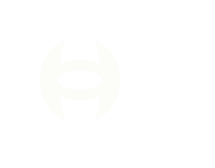
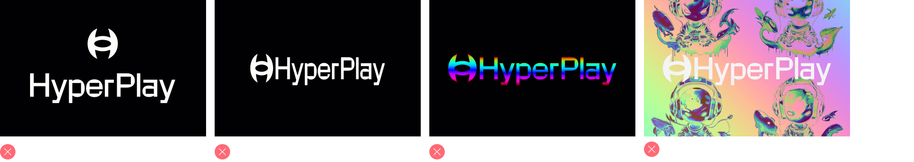
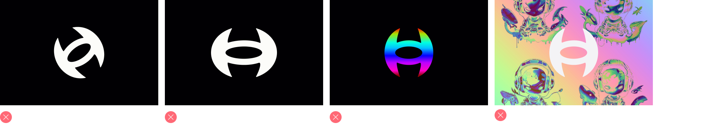

# branding-resources
Follow these guidelines when promoting HyperPlay in marketing communications, including advertising, articles, websites, and printed promotions.

<h1>Wordmark Logo</h1>

<h1>Logo</h1>

<h1>Clear Space</h1>

<h2>Wordmark</h2>
Keep a clear space of 'X' aaround our logo at all times to maintain its visual impact in every composition. X = the x-height of the wordmark.

<h2>Logo</h2>
Keep a clear space of 1/2 X around the logo at all times, to maintain its visual impact in every composition.

<h1>HyperPlay + Partners<h1>

 
<h1>Things to Avoid</h1>
  
  
  
    
